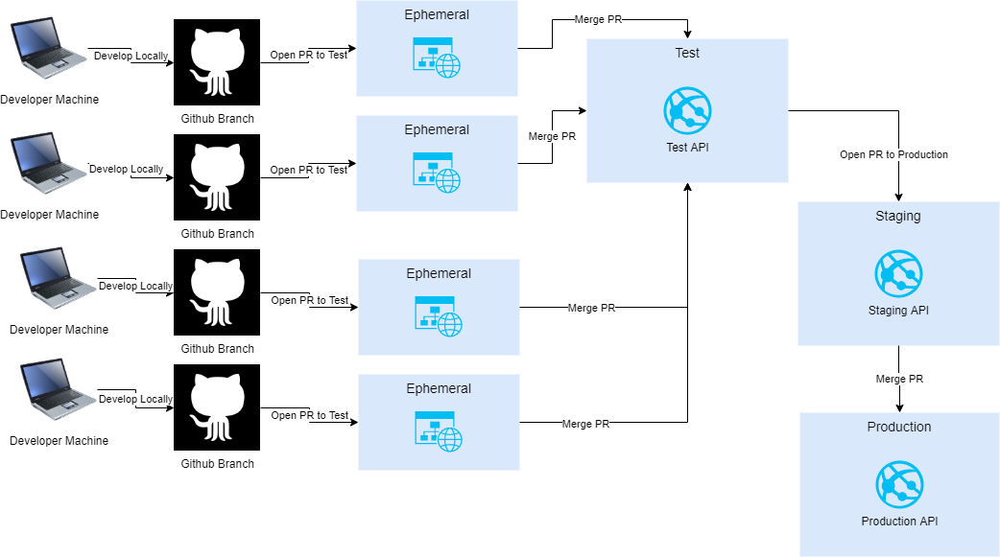

# AzureFunctions_GitHubActions

Excellent! Contoso Coffee is extremely excited about all the progress you have made to this point. After talking to the development team, they let you know that they’ve set up their Git strategy to consist of a number of branches in their repository for their development team and test environments.

Specifically, they will only have the completely functional code running on the ‘master’ branch from the repository.

In addition to that, they’ve decided they’d use a development branch for Continuous Delivery to dev/test environments.

Developers will work in their own branches and/or feature branches. When they complete their work, they will open up a pull request to the development branch.

Once all the tests are done and no further development is required, a new PR will be opened which will allow the application to get deployed to a pre-production slot.

Closing the PR also means that the code in master will be the code running in production.

At the conclusion of this activity, your infrastructure and your application will be able to be fully deployed via GitHub actions using pull-requests as triggers for each step in the process. This will ensure the safe ability to promote the application through testing and into production.

For more information, review the following proposed architecture:

